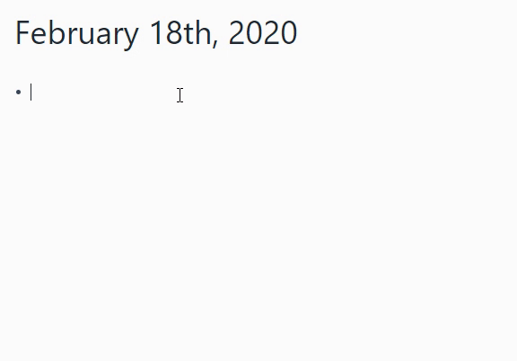

<div align="center">

# Roam Toolkit - [Roam](https://roamresearch.com) force multiplier

</div>

Browser extension designed to improve your experience of using Roam Research

## WalkThrough

[](https://youtu.be/llP-3AqFGL8)

[Document in the video](./media/walkthough_0.1.md)

## Installation
It's available in their respective extension stores for both [Chrome](https://chrome.google.com/webstore/detail/roam-toolkit/ebckolanhdjilblnkcgcgifaikppnhba)  & [Firefox](https://addons.mozilla.org/en-US/firefox/addon/roam-toolkit/)

## Currently supported functionality
1. Fuzzy Date functionality
  
  
1. Date increment/decrement
    - If there is only 1 date in the block - place the cursor anywhere withing it and press `Ctrl-Alt-Up/Down`, if there is more then 1 date - you need to place the cursor within the name of the date.
1. Spaced repetition
   * Anki SRS algorithm & Shortcuts
   * Leitner System automation shortcuts 
1. Block actions: Delete, Duplicate
1. Task estimates
1. Custom CSS


## Running the development version
### In terminal or command prompt

```
install dependencies
 - npm install
Transpile the code
 - npm run dev (only transpiles the code)
 - npm run watch (transpiles and watches for code changes)


yarn commands will work too if yarn is installed.
```

### In Chrome web browser
1. Go to: [**chrome://extensions**](chrome://extensions)
2. Toggle: "**developer mode**" on.
3. Click on: "**Load unpacked**"
4. Select the newly created folder "**dist**" from the project folder.
5. Thats it.

### In Firefox web browser
1. Go to: [**about:debugging**](about:debugging)
2. Select: "**Enable add-on debugging**"
3. Click on: "**Load Temporary Add-on…**"
4. Open the newly created folder "**dist**" from the project folder, and choose the "**manifest.json**" file.
5. Thats it.

## License
MIT
