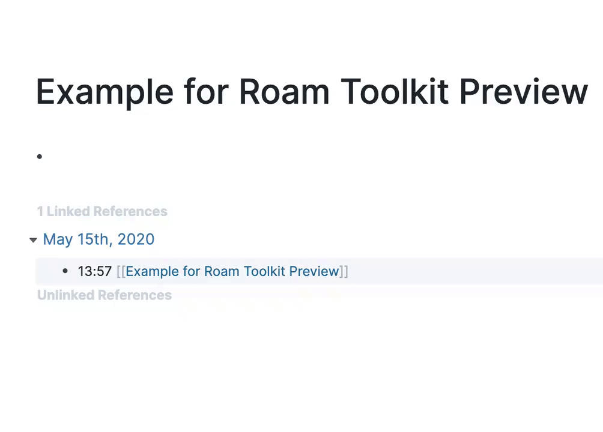
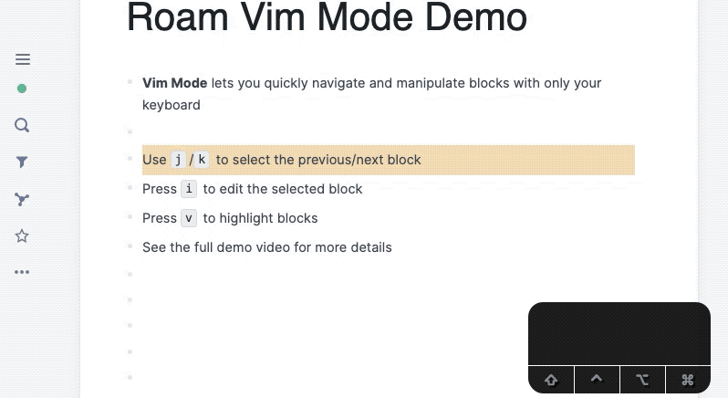

<div align="center">

# Roam Toolkit - [Roam](https://roamresearch.com) force multiplier

</div>

Browser extension designed to improve your experience of using Roam Research

## WalkThrough

[](https://youtu.be/llP-3AqFGL8)

[Document in the video](./media/walkthough_0.1.md)

## Installation
It's available in their respective extension stores for both [Chrome](https://chrome.google.com/webstore/detail/roam-toolkit/ebckolanhdjilblnkcgcgifaikppnhba)  & [Firefox](https://addons.mozilla.org/en-US/firefox/addon/roam-toolkit/)

## Features

### Date Manipulation

You can create dates using [**natural language**](https://github.com/wanasit/chrono):


You can also **increment or decrement dates**:

* While editing a block, press `Ctrl-Alt-Up/Down` to increment/decrement any date inside. If a block has multiple dates, place your cursor on the date.
    
### Spaced Repetition

Implements SM2 Spaced repetition algorithm (Anki version) as described here: https://docs.ankiweb.net/#/faqs?id=what-spaced-repetition-algorithm-does-anki-use for Roam blocks.  
Put a cursor inside the block and pres Ctrl+Shift+ [number between 1 and 4 signifying ease of remembering this card], and the plugin is going to reschedule the Block accordingly (tagging it with the appropriate date, and some metadata tags)

Watch the video for more details:
[](https://youtu.be/08o8q_bOedw)

### Live Preview of pages



### Vim Style keyboard shortcuts



For more details, see the [full video](https://youtu.be/ZxtT05CjOyo)

### Other Features

1. Block actions: Delete, Duplicate, Copy Block Reference
1. Task estimates

## Contributing

See [CONTRIBUTING.md](./CONTRIBUTING.md) for details on how to start contributing.

## Running the development version

1. Checkout the repository

2. In terminal or command prompt run the following commands:

    ```bash
    npm install # Install dependencies
    npm run prod # Transpile the code
    ```

### Load extension into the browser

#### Chrome
1. Go to: [**chrome://extensions**](chrome://extensions)
2. Toggle: "**developer mode**" on.
3. Click on: "**Load unpacked**"
4. Select the newly created folder "**dist**" from the project folder.
5. That's it.

#### Firefox
1. Go to: [**about:debugging**](about:debugging)
2. Select: "**Enable add-on debugging**"
3. Click on: "**Load Temporary Add-on…**"
4. Open the newly created folder "**dist**" from the project folder, and choose the "**manifest.json**" file.
5. That's it.
